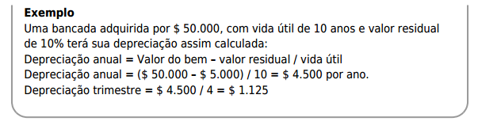

# Manual dos diretores

### Máximas

"Notadamente não há uma fórmula mágica para se ganhar o jogo." 

"Uma estratégia bem-sucedida em um momento pode não ser adequada em outro"

Muitas informações contidas neste manual só serão plenamente compreendidas na prática do jogo e,
à medida que o aprendizado se consolida, mais fácil se torna o processo de gestão da empresa. Assim
ocorre no mundo real: depois que vivenciamos ou experimentamos algumas situações, nos sentimonos
mais confortáveis em nossas ações e nossas decisões.

## Sumário

### 1º Parte: O Jogo: Características, Dinâmica e participação das equipes

### 2º parte: Cenário - A empresa: Regras, Explicações e Funcionamento do ambiente  

### 3º parte: Atividades e Como as equipes trabalham

-------------------------------------------------------------------------------

## [1º Parte: O Jogo]

- Uma industria. 

- Você é o diretor.

- Responsável por: 
	- tomar decisões de produção;
	- comprar máquinas;
	- contratar operários;
 	- escolher fornecedores;
	- estudar o comportamento do mercado
	- estar especialmente, atento às mudanças no ambiente. 

### Objetivo

Obter o melhor desepenho.

Avaliação principal é a medida pelo retorno do investimento.

**O índice utilizado para ranqueamento das empresas será o de rentabilidade do ativo acumulado** [Ativo -> São todos os Bens, Direitos e Valores a Receber de uma entidade]

### Elementos do jogo

A simulação é um jogo interativo baseado em ambiente web e envolve quatro elementos proncipais:

- As equipes de diretores;
- O simulador;
- O Jornal;
- Manual dos Diretores (este documento)

#### Diretores

Uma equipe de diretores que se organizará com tomada de decisões.

#### Dinâmica do jogo

Cada tomada de decisão implica num resultado. Nós os diretores, temos responsabilidade por essas tomadas. Com isso, temos o objetivo de canalizar essas tomadas em prol do bom desempenho da empresa.

#### Mediador do jogo 

O mediador é responsável por fazer o papel de:

- Banco Central;
- Definições das taxas de juros;
- Disponibilidade e limites de crédito;
- Sindicato ou Associação de Operários;
- Questões relacionadas a salário;
- Disponibilidade para contratações;
- Agência de propaganda;
	- Definição de preços e inserções de publicidade na mídia.
- Fornecedores e políticas de preço;
- Disponibilidade de matéria prima, prazos e descontos.
- Controlar a agenda;
- Informando prazos para tomadas de decisões;
- Pode cobrar consultorias;
- Multar e premiar equipes;

#### Fontes de informações

As empresas possuem três fontes de informações:

- O Manual de diretores;
- Relatórios Contábeis, Financeiros, Operacionais e de Avaliação;
- O Jornal;

**O Manual dos Diretores (Bíblia)** deve ser lido atentamente e estar sempre à mão, pois é aqui que se
encontram das instruções sobre as regras do jogo e sobre as variáveis que estão em jogo.

**Os Relatórios (Status)** são emitidos pelo Simulador e servem de base para análise e para tomada de decisões.
Eles mostram como está a situação da empresa nos vários aspectos de atuação, como a produção, o
financeiro, o marketing e também mostram, quando habilitado, o resultado o planejamento feito pela
empresa.

**O Jornal (O que impacta)** apresenta as principais mudanças no ambiente em que a empresa atua. Podem ocorrer, por
exemplo, greves dos empregados, aumento no preço dos insumos, variação das taxas de juros,
limitações ou incentivo ao crédito, entre outros fatos. Novidades ou dicas de oportunidades para boas
escolhas e administrar melhor a empresa podem ser percebidas através de uma leitura atenta do jornal.
Deve-se estar atento para os seguintes 

**Dicas**

- Um período corresponde a um trimestre.
- Todas as equipes devem trabalhar em sinergia. Pois todas são concorrentes. E prazos devem ser respeitados.
- A duração do jogo é determinada pelo mediador, e nem sempre é sabido quando o jogo termina.
- A equipe ganhadora do jogo deverá se destacar no critério de melhor **rentabilidade do ativo (acumulado)**, ou por um outro critério para da definição final da ordem de classificação das demais equipes.

### O Mundo Simulado

Em suma, o sistema simula um ambiente que **compreende um mercado (interno e externo)**, que é **dividido em regiões**.

- **Cada região há um mercado consumidor (demanda) e não há interação entre elas, ou seja, cliente potencial de uma região não compra em outra região. Ele não é influenciado pelas estratégias de marketing em outras regiões**.

- **Significa que a empresa, para vender, deverá divulgar seu produto em determinada região através da propaganda. Deverá também descobrir qual a melhor combinação de preço e prazo que pode praticar. Neste processo a empresa obtém sua receita e, depois de verificados seus custos e despesas, avalia o resultando do período.**

#### Personagens atuantes no simulador

- **Governo**: 
	- Regula a conjuntura econômica, define alíquotas para o imposto de renda e CSLL; 
	- Estabelece a taxa básica de juros;
	- Fixa câmbio;
	- Controla/Limita preços e regular o uso de inserções de propaganda;
- **Banco**:
	- Disponibiliza linhas de crédito (dinheiro) para:
		- Investimento;
		- Capital de giro;
	- Capta recursos das empresas através de aplicações financeiras;
- **Fornecedores**:
	- Suprem as necessidades de insumos, máquinas, terrenos e depósitos;
	- Definem descontos para compras de materiais em grandes volumes, bem como acréscimos para compras a prazo;
- **Agência de Publicidade**:
	- Define o preço das inserções de propaganda.
- **Sindicato dos operários**:
	- Negócia com os empresários melhores salários, ritmos de trabalho (horas extras), contratações e demissões.

**Em síntese:**

A demanda que uma empresa obtém em determinado período do jogo é resultante das forças que atuam no mercado. Não se
sabe, a priori, o comportamento do mercado. Apenas são
conhecidas quais as variáveis podem produzir efeitos.
Neste caso, são consideradas as influências das
empresas entre si, além de outros efeitos como
conjuntura econômica, sazonalidade, crescimento natural do mercado consumidor,
influência da cotação do câmbio no mercado externo.

**Com isso, cuidado ao estimar a demanda, devido as várias variáveis do mercado: intenção do consumidor, valores, prazos e propagandas.**

**A ausência de dados sobre os modelos matemáticos que o jogo utiliza para simular o
comportamento do consumidor é proposital**

**Cada empresa ocupa uma região, mas ambas vendem igualmente para todas as demais regiões.**

**Na região do mercado externo, a
população é maior e, consequentemente, o potencial de
demanda nesta região também é maior.**

**Importante: A quantidade total de regiões é igual ao número total de empresas participantes + 1
(correspondente a região do mercado externo). Se o seu jogo tem 5 empresas, existem 6 regiões. Se
tem 7 empresas, 8 regiões, e assim sucessivamente.**

**Dicas:**

- Em todas as regiões o consumidor comprará uma unidade do produto a cada período e se sente
atraído por preços baixos, prazos longos e por maior número de inserções de propaganda na mídia.
Entretanto, a propaganda tem efeito até um determinado número de exposições, além do qual o
consumidor não é mais influenciado.

- O consumidor evita comprar
de empresas que tenham seus preços muito acima da média do mercado em determinado
período. Esta rejeição é potencialmente mais forte nos casos de empresas com preços a
partir de 20% acima da média e a demanda será praticamente nula. 

-  O governo não permite variações de preços superiores a 30% (trinta),
tanto para cima como para baixo, em relação ao período imediatamente anterior.

- O mercado tem tendência de crescimento natural em média entre 5% e 6% ao período.

- Em períodos sazionais: ocorre nos períodos múltiplos de quatro: (quatro, oito, doze…). Em geral este pico
corresponde a um acréscimo de 60% sobre a demanda normal.

- **Os valores do crescimento natural do mercado, bem como o efeito da sazonalidade
poderão ser utilizados nas previsões do comportamento mercado, entretanto deve-se
considerar:**
	- **O crescimento natural de 6% de período a período é um valor médio**. Na simulação este
crescimento é resultado de uma **variável aleatória entre 0% e 10%, porém associada a uma
probabilidade maior de ser um valor intermediário**.

	- As decisões de todas as empresas, sobre preço, prazo e propaganda, ao longo do jogo também
influenciam o mercado. Dessa forma o **efeito do crescimento natural e da sazonalidade pode ser
distorcido para o caso de previsão**.

#### Conjuntura econômica

A conjuntura econômica é uma variável que pode ser controlada pelo mediador e, no jogo, pode-se
observar o comportamento geral da demanda sob três possíveis conjunturas econômicas distintas:
**normal, aquecida e recessiva**.

**Dicas:**

- Os resultados e variações podem ser observadas junto do **Jornal da Indústria**,
que indica a variação do **Índice de Conjuntura Econômica**.

- A demanda da empresa tende a aumentar quando é fornecido um prazo maior de pagamento aos
clientes. O prazo é representado em número de dias.

- A partir do momento que um determinado prazo é concedido, parte dos pagamentos somente será
realizada no período seguinte.

- Entretanto, a empresa que oferece prazo, com a finalidade de estimular a demanda, poderá oferecer
aos seus clientes um desconto como opção para compra à vista. Isso vai aumentar os recursos
disponíveis no mesmo período. Este desconto, porém, não tem nenhuma influência sobre a demanda,
pois é utilizado apenas pelos clientes que já escolheram o produto da empresa.

- O desconto deve ser usado em conjunto com o prazo, pois enquanto o cliente é atraído por um prazo
maior, ele só decide pela forma de pagamento após comparar o desconto e a taxa de juros do banco
central.

- Quanto maior o desconto, maior o volume de compras à vista. Com descontos iguais ou maiores do
que a taxa do banco central, praticamente todas as compras serão à vista, mas a lucratividade
poderá estar comprometida.

- Deve-se considerar que o trimestre tem 90 dias. Prazos menores que este, uma parte da receita das
vendas será recebida no próprio período simulado.

## [2º Parte: Cenário - A empresa]

- Uma fábrica de eletrodosméticos, abrangendo aspectos de produção, marketing e finanças.

### Infraestrutura inicial - Instalações, máquinas e equipamentos

O ambiente do jogo já inicia com as configurações dos bens das empresas, como as máquinas,
depósitos e terrenos. Esses bens têm características e especificações próprias, como valor, vida útil,
valor residual, consumo de energia e depreciação.
A tabela a seguir apresenta os bens que a empresa possui:

Com exceção das bancadas (máquinas) de montagem, os demais imobilizados constituem o cenário da empresa
e não podem ser comprados ou vendidos durante o jogo. A depreciação é calculada normalmente
com, base na vida útil, para compor custos e despesas do período.

#### As bancadas de montagem

- Operam por período, 550h cada unidade.
	- Recebem manutenção preventiva ao custo de **R$ 10.000 por período**.
		- Mesmo recebendo manutenção, a própria vida útil dos equipamentos vai acabar por reduzir a capacidade de produção de montagem dos produtos. **O desgaste afeta a produtividade num ritmo de 2% ao período, e deve ser calculado proporcional ao tempo de uso.**
		-  

- **As máquinas consomem energia elétrica. É um custo direto, pois o consumo está ligado diretamente ao tempo de uso na fabricação do produto.** 
	- O **preço do kW.h é, inicialmente, de R$ 0,15** (ou $ - dólar?)
	- Fórmula de cálculo:
	

- Existe apenas um fornecedor de bancada de montagem e a aquisição deve ser planejada,
considerando a decisão para aumentar a capacidade de produção da empresa. A empresa poderá
financiar a compra de máquinas por meio dos bancos, que oferecem uma modalidade de
financiamento específica para esse tipo de investimento.

**Inicialmente existem dois modelos de bancadas disponíveis para compra.**

- Veja no quadro abaixo as
prncipais características de cada modelo:

	- **Deve-se observar o tempo de entrega. Bancadas do modelo Std estarão disponíveis para uso
apenas no período seguinte da compra**

### Depreciação

A depreciação será calculada para cada bem considerando o valor de aquisição, o valor residual e a vida útil. Será considerada uma despesa, no caso do prédio administrativo e, nos demais, custo indireto de produção.

### Recursos Humanos

- A empresa possui inicialmente, 9 operários em seu quadro, e cada um trabalha 550 horas por período.

- Cada produto exigirá certo tempo de mão de obra direta. Portanto, a empresa deverá resolver a
equação do uso desse recurso. Assim, ao se planejar o que se deseja produzir, será possível saber
quanto tempo de trabalho dos operários será necessário naquele período.

- A empresa paga o valor base de **R$ 6,50/hora.**
	- Com todos os encargos (férias, INSS, FGTS, 13º Salário, descanso semanal remunerado), o valor vai para **R$ 12,75**
	- O tempo de ociosidade do funcionário será informado como **ociosidade do período**.

A empresa pode optar pelo expediente de horas extras:

- 1 hora extra por dia aumenta a capacidade de produção em 13,6%. O adicional de custo da hora é
de 75%.

- 2 horas extras por dia aumentam a capacidade de produção em 27,0%. O adicional de custo da
segunda hora extra é de 100%;

**Atenção!**

**Quando a empresa utiliza 1 ou 2 horas extras, as horas disponíveis de bancadas
também aumentam proporcionalmente.**

- A cada vez, os funcionários vão ficando melhores. Fazendo mais em menos tempo. **Tal produtividade representa para a empresa um ganho de tempo entre 1% a 2% ao
período**.

- Verificar questões de férias remuneradas. **As férias são coletivas e correspondem a um intervalo de 30 dias**.
	- **Nos períodos de férias, o tempo da mão de obra é reduzido em 1/3**.
	

- **No cálculo do salário do período são adicionadas 110 horas por empregado a título de DSR (Descanso Semanal Remunerado). Sobre a folha de pagamento incidem encargos de 36,8%**.

#### Treinamento

A empresa pode ou não ofertar treinamento para seus funcionários. Não ofertar, também é uma decisão. E isso afeta no nível de produtividade dos mesmos.

**Atenção!**

**Os treinamentossão oferecidos apenas para as novas contratações.**

#### Benfícios

Além do treinamento a empresa poderá oferecer, aos seus funcionários, benefícios relacionados à
alimentação e assistência médica. Veja a tabela abaixo:

#### Mercado de Trabalho

O coeficiente de satisfação da mão de obra é calculado e atualizado a cada período,
considerando aspectos como salário pago pela empresa, participação nos lucros, porte da empresa,
treinamento e benefícios como assistência médica e auxílio alimentação. Sabe-se apenas que o
salário pago pela empresa é o item de maior importância no cálculo do coeficiente de
satisfação da Mão de obra.

A empresa terá disponível um gráfico que apresenta aos diretores como está sua situação perante o
mercado:

Esse gráfico ilustra, no período inicial, o coeficiente de satisfação dos empregados de uma empresa
(Charlie), o coeficiente médio de todas as empresas, bem como o maior coeficiente do período. Será
útil para orientar possíveis decisões na gestão dos recursos humanos.

Os empregados poderão entrar em greve quando o indicador de satisfação dos empregados da
empresa apresentar diferenças entre 30% a 80% em relação à média da satisfação do mercado,
conforme mostra o quadro a seguir:

Para manter um bom indicador de satisfação dos empregados a empresa deve gerenciar seus
recursos humanos observando a relação custo/benefício:

- Aumentos de salários
- Assistência médica básica ou completa
- Alimentação na empresa ou vale alimentação
- Treinamento básico ou avançado

Outros aspectos indiretos que influenciam no indicador de satisfação da mão de obra são:

- Crescimento da empresa na sua capacidade produtiva (porte de produção)
- Capacidade de gerar e distribuir bons lucros aos seus empregados.

### Os Produtos

- 3 Produtos comercializados pela empresa.
	- Multiprocessador;
	- Liquidificador;
	- Mini-processador.

- Cada produto é vendido para um mercado específico, ou seja, o cliente que compra o miniprocessador
não é o mesmo que compra o liquidificador. Um produto não concorre com o outro.

- Cada produto exigirá da empresa um processo de montagem, que inclui os componentes, o tempo
dos operários e tempo de montagem nas bancadas.

No quadro abaixo estão relacionados os três produtos fabricados, identificando os componentes
utilizados na montagem, bem como suas respectivas quantidades. Também estão identificados os
tempos de máquina e de mão de obra direta.

 - Os componentes comprados que ficam em estoque de um período para o outro, geram um custo de
armazenagem equivalente a 1,5% sobre o valor inicial dos estoques.

- Os produtos montados são enviados para o depósito da área comercial. Há uma despesa por período
de 2,5% sobre o valor o custo dos produtos estocados, a título de despesas de armazenagem.

#### Compra de insumos

- Existem 4 fornecedores:
	- Embrapel; 
	- Interplast;
	- Plastec;
	- Resilbrás.

**Atenção!**

**Com exceção do fornecedor Embrapel, que entrega no início do período, os demais fornecedores
entregam seus produtos apenas no final do período, ou seja, insumos comprados em um período ficam disponíveis para consumo apenas no próximo período.**

- As compras podem ser pagas à vista e a prazo, dependendo do fornecedor. Nas compras a prazo os
fornecedores cobram juros, podendo variar nos primeiros períodos de 3,3% a 3,9%. Os dados de
preços, tributos, prazos, descontos e taxa de juros podem ser verificados nos quadros abaixo
(também disponíveis no simulador, em 'Informações Gerais' > 'Configurações do Período'):

#### Custos de produção

Estes custos serão apropriados aos produtos através de critérios de rateio (divisão), tais como:
volume/valor dos insumos utilizados, tempo/valor da Mão de obra Direta, volume de produtos
acabados, número de horas de máquina e valor dos custos diretos.

#### Tributos

- Existem alguns tributos, como Imposto de Renda - IR, Contribuição Social sobre o Lucro Líquido -
CSLL, Imposto Sobre Circulação de Mercadorias – ICMS, Imposto sobre Produtos Industrializados - IPI.

- Sobre o lucro do período a empresa paga 15% de IR e 9% de CSLL e o recolhimento ocorre sempre no
período seguinte. A empresa paga, ainda, um adicional de 10% sobre o valor do lucro que exceder $
60.000. O agente arrecadador não permite compensar prejuízos ocorridos em períodos passados.

- Sobre o faturamento incidem ICMS e IPI diferenciado para cada região (veja tabela abaixo) e
compensa o recolhimento pelo crédito dos tributos sobre as compras de insumos. A alíquota de IPI e
ICMS na compra de insumos depende do fornecedor

#### Banco Central

O Banco Central atua no mercado estabelecendo a taxa básica de juros, **inicialmente de 3,00%**. **Serve
de base para o cálculo das demais operações de crédito, incluindo os empréstimos, financiamentos,
aplicações financeiras, compras a prazo. Também será referência para a decisão do cliente, se pagará
as compras feita na empresa à vista ou a prazo.**

#### Bancos de Crédito

Existem dois bancos:
- Invest Banco
- Supreme Banco

#### Análise de Crédito

- Antes de conceder dinheiro, os bancos avaliam a situação da empresa para tal.

- As taxas de juros que os banco cobram das empresas variam de acordo com o
grau de endividamento e da rentabilidade da empresa, ou seja, quanto menor for a capacidade
financeira, maior será o risco percebido e, consequentemente, maiores serão as taxas de juros.

- “A” - Risco Baixo – Taxa Base X 1,0
- “B” – Risco Moderado – Taxa Base X 1,3
- “C” – Risco Alto – Taxa Base X 1,9

**Observação:** O fator de risco não é aplicado para o cálculo da taxa de juros de aplicações
financeiras.

- A disponibilidade de crédito que o banco oferece às empresas em um período é de 90% do valor do
Patrimônio Líquido menos os passivos com bancos do trimestre anterior.

- Inicialmente todas as empresas estão classificadas com risco baixo (A) e têm, aproximadamente, $
685.000 de limite para obter crédito nas linhas Empréstimo de Giro e Financiamento de Imobilizados.

- **Veja os detalhes dos bancos e classificação de risco no relatório 'Configurações do Período' (no menu
'Informações Gerais')**

#### Empréstimos e financiamento

Existem 3 modalidades de empréstimos:

- **Financiamento**: concedido apenas para financiar investimentos (compra de bancadas de
montagem). O montante será amortizado em quatro períodos, com carência três parcelas.
Normalmente, entre as modalidades, tem a menor taxa de juros

- **Empréstimo de giro**: destina-se para as necessidades de capital de giro. O montante poderá ser
parcelado em até três períodos, sem carência, e deve ser pago juntamente com os juros.

- **Empréstimo especial**: semelhante ao empréstimo de giro, porém com juros sempre mais altos e
amortização em apenas 1 período, sem carência. **É concedido automaticamente quando a empresa ficar com saldo negativo**.

**Atenção: Mudanças nas políticas de crédito dos bancos, quando ocorrem, como limites, número de parcelas,
carência para amortização e taxas de juros são informadas aos empresários por meio do Jornal da
Indústria.**

- As empresas começam o jogo com seus ativos financiados parte por capital próprio e parte por capital
de terceiros (as dívidas).

- As dívidas inicias da empresa são representadas por:
- Fornecedor, no valor aproximado de $ 592.000,00, que deverá ser paga já no período #1.
- Financiamento, no valor de $ 500.000, com prazo de carência de 3 períodos e parcelado em 4 vezes
de $ 125.000. O pagamento da primeira parcela ocorre somente no período #3. Durante os períodos de carência a empresa paga somente os juros, no valor de $ 15.000 por período.

#### Aplicações financeiras

É possível realizar aplicações no mercado financeiro com o dinheiro excedente do caixa para obter receita extra.
 - A aplicação financeira é por prazo fixo de um
período, ou seja, aplicação feita em determinado período será resgatada automaticamente no período
seguinte, juntamente com o rendimento. 

#### Distribuição de dividendos

A política de dividendos da empresa exige que 10% do lucro acumulado anual seja destinado aos
acionistas. Isso quer dizer que a cada 4 períodos (períodos 4, 8 e 12) o simulador, automaticamente,
incorpora 90% do lucro acumulado do ano ao capital social da empresa e o restante destina aos
acionistas.

#### Despesas

Nos setores administrativos e de vendas ocorrem algumas despesas de natureza fixa e algumas
despesas de natureza variável:

- As despesas financeiras são calculadas em todos os períodos, sempre sobre o saldo das dívidas
contraídas pela empresa, através de empréstimos e de financiamentos, considerando o percentual do
juro contratado.

#### A Demanda e a Venda dos produtos

Os 3 tipos de produtos são vendidos para clientes específicos, ou seja, a demanda de um não é afetada pela oferta de outro.

**Não há uma decisão propriamente dita para vender um produto, pois é o cliente que decide comprar
o produto da empresa.**

Os clientes constituem a demanda da empresa e estarão distribuídos entre as várias regiões nas
quais a empresa atua, seguindo algumas regras específicas:

- Primeiro, a demanda da região onde a empresa está instalada terá preferência no atendimento;
- Depois de atender a demanda da região e havendo produtos, eles serão distribuídos
proporcionalmente entre as demais regiões;

**Se atentar:**

- Ter sempre o produto disponível para o cliente;
- Preços consistentes;
- Bom atendimento;
- Propaganda insuficiente;
- Prazo de pagamento curto;

Outros pontos a se atentar:

- As empresas deverão, a cada período de decisão, elaborar o planejamento de vendas. Para isso,
deverão estimar a demanda do produto, em cada região.
- A demanda efetiva, ou seja, aquela demanda que a empresa já conquistou no período atual,
representa os clientes que optaram por adquirir os produtos da empresa.
- A demanda poderá ser maior que as vendas, quando a empresa tem estoque disponível menor do que o número de clientes que desejam comprar seus produtos.
- A demanda poderá ser menor que as vendas, quando a empresa tem estoque de produtos
excedentes (sobras depois de atender seus próprios clientes) e são utilizados para atender os
clientes redistribuídos de outras empresas que não tinham estoque suficiente para seus clientes.

Tanto a determinação da demanda total quanto a distribuição desta demanda entre as empresas e
regiões é feita através de estimativas, que deverão ser feitas com base no conhecimento do
comportamento geral do consumidor e das decisões de períodos passados da empresa e dos
concorrentes e das reações reais apresentadas pelos consumidores à estas decisões.

A estimativa da demanda deve ser feita com critério, pois não existe uma equação matemática capaz
de encontrar esta resposta. Sabe-se que a demanda é influenciada por diversas forças do mercado e
envolvem muitas variáveis, das quais só algumas são controladas pelas equipes. Mesmo assim é
possível antever sua tendência, um pouco mais difícil no início do jogo, mas logo compreendida, com
a experiência de algumas rodadas.

As variáveis que influenciam a demanda podem ser separadas em dois grupos:
- Variáveis de efeito global sobre o mercado
	- Conjuntura econômica, sazonalidade e crescimento do mercado consumidor;
	- Fidelidade do cliente;
- Variáveis de efeito sobre determinada região do mercado
	- Política de marketing da empresa (preço, propaganda e prazo)
	- Política de marketing das empresas concorrentes (preço, propaganda e prazo)
	- Taxa de câmbio (mercado externo)

Com isso, a partir do conhecimento da demanda efetiva da empresa em determinado período, é
possível estimar um percentual de variação da demanda, considerando os efeitos que estas variáveis
estarão produzindo naquele momento em determinada região ou mercado.

Esta prática considera uma real perspectiva do mercado. Embora sem certezas do que irá ocorrer, é
possível fazer projeções mais bem elaboradas e consistentes, diferente de meras suposições ao
acaso, conhecidas popularmente como “chutes”.

Esta variação pode ser projetada para um mercado como um todo, ou projetada para cada região, o
que exigirá um pouco mais de trabalho.

A previsão da demanda deve ser considerada como algo muito importante, pois muitas ações
internas na empresa dependerão de como se vê a empresa lá fora, com contexto do mercado.

Os planos de expansão, crescimento, níveis e ritmo de produção, estratégia de marketing
dependerão desta visão que se faz do mercado.

As equipes devem considerar que, mais importante que organizar a empresa em suas operações internas (tudo é possível controlar), é ser capaz de perceber as movimentações e tendências e
antever as oportunidades e ameaças.

## [3º Parte: As equipes e suas funções]

- Organizadas entre 3 e 5 participantes.

Para o bom desempenho no jogo é muito importante que as equipes se organizem e que todos
participem ativamente das tarefas.

A cada rodada é um capítulo de uma história, e torná-la emocionante para todos depende também de
você.

### Como as equipes trabalham

O conhecimento das equipes é construído através dos itens:
- Análise dos relatórios de um período simulado.
- Informações obtidas do Jornal da industria.
- Regras deste manual.

Tudo isso é convertido na projeção do cenário do período seguinte. Tudo isso pelo processo repetitivo de tomada de decisão nesses períodos.

**Qual o próximo passo? A situação inicial evidencia que todas as empresas estão com alguns
problemas relacionados à produção e precisam ser resolvidos de imediato. Assim, é necessário
identificá-los e tomar as primeiras decisões. Isso implica em produzir mais e a demanda se mostra
bastante aquecida.**

**Dicas:**

- Observar sempre as limitações no uso dos recursos, como por exemplo,  tempo disponível de máquinas, pessoal e insumos. Podem se tornar gargalos, não tendo solução imediata.

- Praticamente todas as decisões tomadas, desde a produção até vendas, de alguma forma implicam
em movimentação de recursos financeiros (pagamentos e recebimentos). Assim, é necessário observar as condições da empresa e tomar as decisões pertinentes.

Em suma, as equipes devem se organizar para analisar e tomar as tomadas de decisões corretas. Após a jogada/entrega das decisões para o sistema/mediador, os resultados serão mostrados e servirão de base para a próxima rodada.
 

